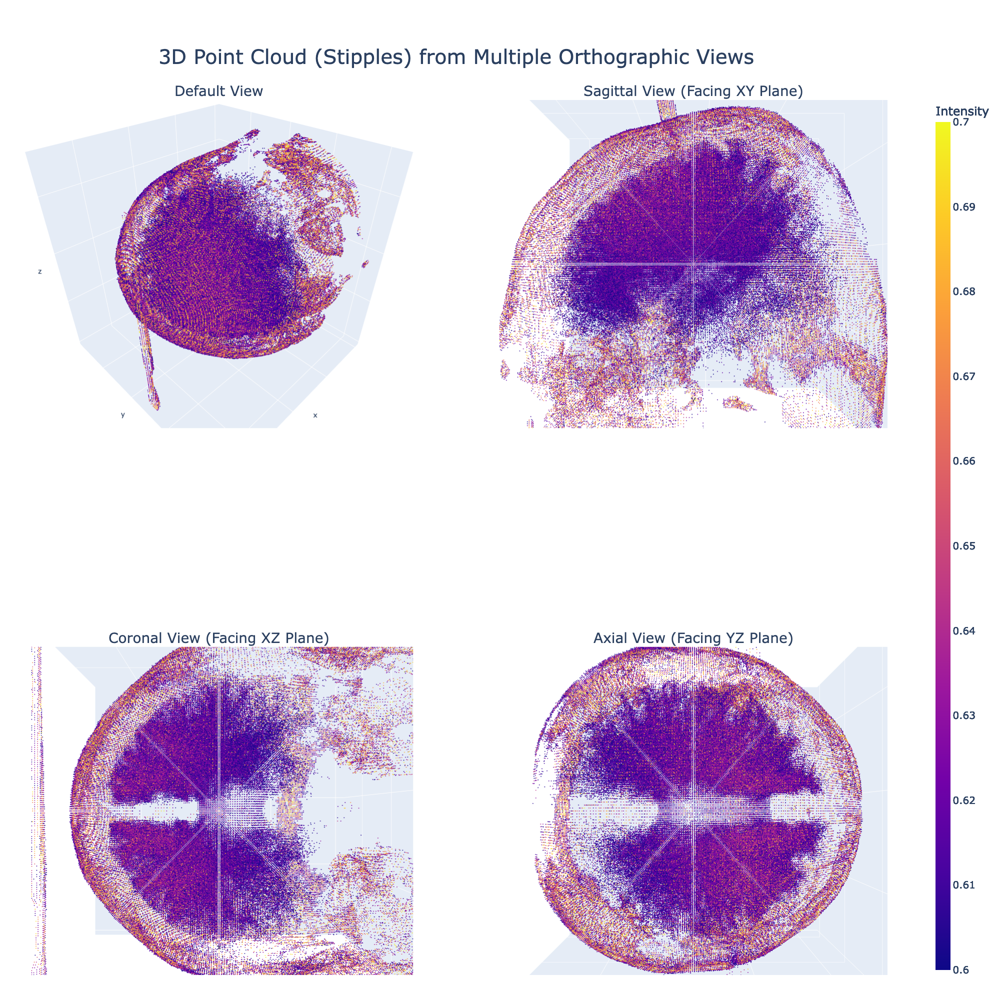

# stipple-me-this
3D stipple art generator using synthetic imaging data.

Stippling is a drawing technique that uses small dots to create an effect of shading and texturing that can also be used to create 3D effects. This art is generated computationally in Python using a synthetic MRI scan image from BrainWeb: Simulated Brain Database using - Plotly. Also called 3D point cloud, this gives an ability to quickly visualize interactive 3D scans and data, with a “fly through” effect allowing zooming, rotating and panning. In this image, we see the default view and the three main MRI planes.

### Created by Dhawal Priyadarshi